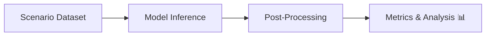

# 🌌 Benchmarking Vision-Language Models (Cosmos Reason1 & Reason2)

## 📌 Contexte
Évaluation de modèles LLM appliqués à des scénarios de conduite.  
Objectifs : fiabilité, robustesse et comparaison multi-modèles.

## 💼 Mon rôle
- Installer et configurer les modèles sur GPU enterprise  
- Authentification HuggingFace & gestion proxy  
- Inference batch sur scénarios  
- Analyse qualitative et quantitative

---

## ⚙️ Architecture pipeline

## 🛠 Méthodologie

* Préparer dataset de scénarios
* Batch inference sur Cosmos Reason1 & Reason2
* Comparer sorties aux ground-truth synthétiques
* Calculer métriques : precision, recall, F1
* Générer tableau synthèse 
---

## 🏆 Points forts

* Analyse temporelle vs statique
* Résultats synthétiques facilement communicables
---

